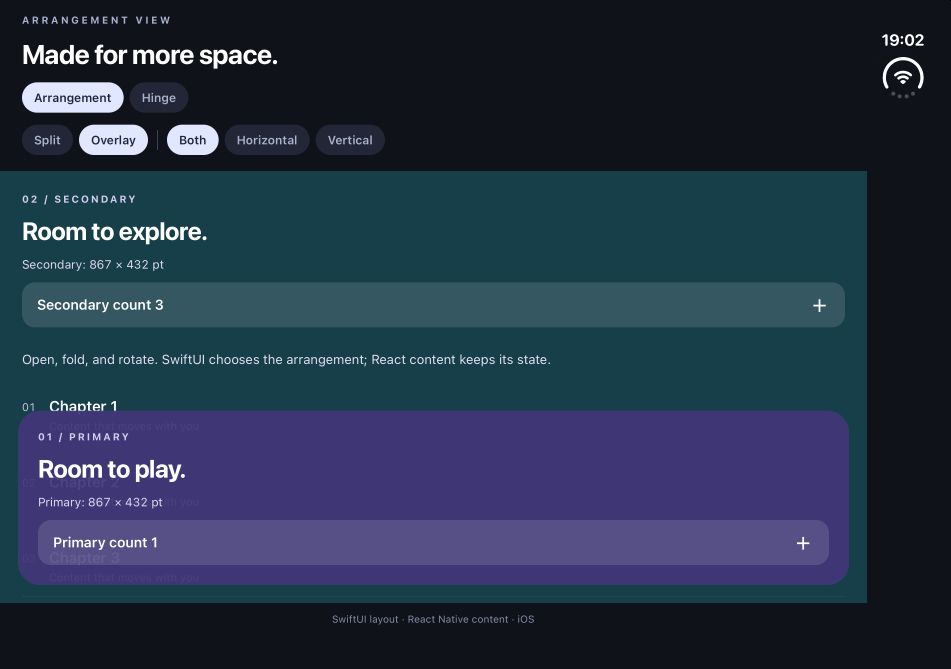
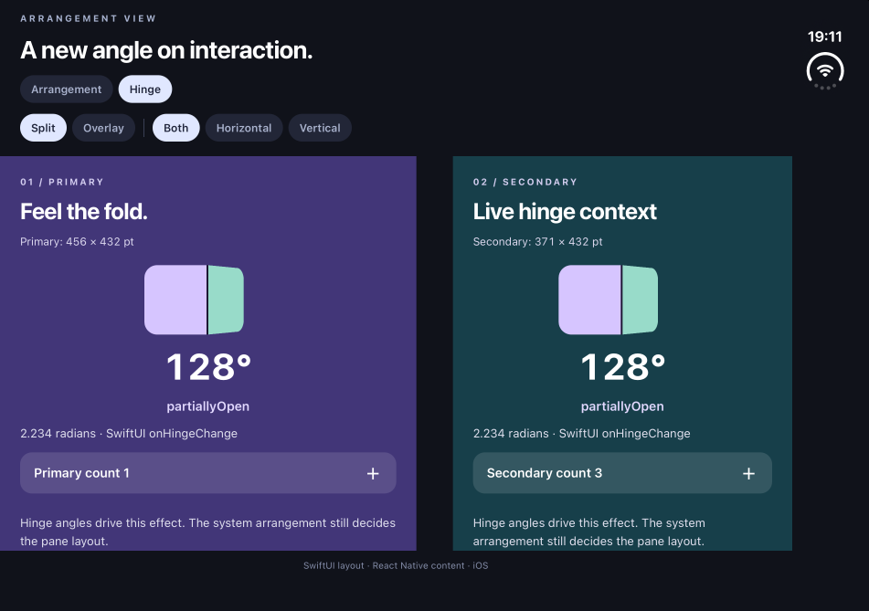

# react-native-arrangement-view

SwiftUI adaptive arrangements and hinge observation for React Native. iOS only, using the New Architecture (Fabric).

`ArrangementView` delegates layout to Apple's SwiftUI `ArrangementView`: two React panes can split horizontally or vertically, overlap, or become hidden as the available space and device posture change. React owns the content and its state.

## Example videos

Recorded on the iPhone Duo simulator using agent-device. Select a preview to open its MP4.

| Adaptive arrangement                                                                                               | Hinge-driven interaction                                                                                    |
| ------------------------------------------------------------------------------------------------------------------ | ----------------------------------------------------------------------------------------------------------- |
| [](docs/videos/arrangement.mp4)                 | [](docs/videos/hinge.mp4)                                |
| [Watch arrangement demo](docs/videos/arrangement.mp4) · split → fold → overlay → unfold; counters keep their state | [Watch hinge demo](docs/videos/hinge.mp4) · 180° → partially open → 180°; the card follows the native angle |

The arrangement recording plays at 2× speed; the hinge recording is real time. See the [validation report](docs/validation.md) for tested behavior, build checks, and remaining limitations.

## Install

This repository is an initial local implementation; it has not been published to npm.

```sh
# In this repository:
yarn install
yarn build
yarn pack --out /tmp/react-native-arrangement-view.tgz

# In a consuming app:
yarn add file:/tmp/react-native-arrangement-view.tgz
cd ios && pod install
```

Use a native build in Expo (`npx expo run:ios` or a development build). Expo Go does not include this library.

iOS 27 also requires the host app to adopt the scene lifecycle. The example enables `ios.enableSceneSupport` through `expo-build-properties` on Expo SDK 57. See [Expo’s scene migration guide](https://github.com/expo/fyi/blob/main/ios-scene-lifecycle.md) for host-app configuration.

| Requirement                                   | Support                                                                                           |
| --------------------------------------------- | ------------------------------------------------------------------------------------------------- |
| React Native                                  | New Architecture; development and validation on 0.86.3 / React 19.2.3                             |
| Native adaptive arrangements and hinge events | iOS 27.1+, built with Xcode 27.1 / iOS 27.1 SDK or newer                                          |
| Older iOS, down to 16.4                       | Deterministic SwiftUI fallback described below                                                    |
| Older Xcode SDK                               | Compiles the fallback; rebuild and rerun CocoaPods with the new SDK to enable native arrangements |
| Android / web                                 | Not implemented; rendering the component throws an explicit unsupported-platform error            |

These Apple APIs are from a beta SDK and may change.

## ArrangementView

```tsx
import { ArrangementView } from 'react-native-arrangement-view';

export function PlayerScreen() {
  return (
    <ArrangementView
      style={{ flex: 1 }}
      arrangement="split"
      axes="both"
      primary={<Player />}
      secondary={<Transcript />}
    />
  );
}
```

| Prop           | Default   | Meaning                                                                                              |
| -------------- | --------- | ---------------------------------------------------------------------------------------------------- |
| `primary`      | required  | Arbitrary React content in the primary slot                                                          |
| `secondary`    | required  | Arbitrary React content in the secondary slot                                                        |
| `arrangement`  | `"split"` | `"split"` or `"overlay"`                                                                             |
| `axes`         | `"both"`  | `"both"`, `"horizontal"`, or `"vertical"`; applies to either arrangement                             |
| `observeHinge` | `true`    | Enables observation for hooks inside this arrangement; disabling it does not disable adaptive layout |
| View props     | —         | Standard React Native `ViewProps`, including `style`, `testID`, and `onLayout`                       |

Give the arrangement a bounded size, usually `flex: 1`. Give each pane's root `flex: 1` to fill its assigned space. SwiftUI determines whether a split is appropriate; an axis restriction does not force two panes to stay visible.

In overlay mode the **primary is in front of the secondary**. Use a transparent primary background and `pointerEvents="box-none"` on its full-size React wrapper for floating controls; its visible controls can still receive touches. Hiding a pane does not unmount its React tree. Changing React keys or conditionally replacing pane components still follows React's normal remount rules.

The component adds no safe-area padding. Place it within the safe area supplied by your screen/navigation container, or handle insets in your content. Do not apply the same inset in both places. SwiftUI owns the pane geometry, and native Fabric state updates the corresponding Yoga dimensions so descendants and `onLayout` receive the assigned size. There is no JavaScript resize-event round trip.

## useHingeChange

Call the hook **inside a component rendered in either pane**. It observes the nearest `ArrangementView`, keeping events associated with that view's scene. It is not a process-wide sensor subscription.

```tsx
import { Text } from 'react-native';
import { useHingeChange } from 'react-native-arrangement-view';

function Player() {
  const hinge = useHingeChange((next) => {
    // Use angle/status for effects or interactions.
    // Let ArrangementView handle adaptive layout.
    console.log(next.angle, next.status);
  });

  return (
    <Text>{hinge.angle === null ? 'No hinge' : `${hinge.angle} rad`}</Text>
  );
}
```

The callback is optional; the hook also returns the current `HingeState` and subscribes the component to updates. It invokes the callback with the initial unavailable state and then changed values. Changing the callback does not replay the current state.

```ts
type HingeState = {
  available: boolean;
  angle: number | null; // radians
  status: 'unknown' | 'closed' | 'partiallyOpen' | 'fullyOpen';
};
```

Before the first native update, without hardware, or when observation is disabled, the state is `{ available: false, angle: null, status: 'unknown' }`. Future unrecognized native statuses remain `unknown`. Apple's SwiftUI `onHingeChange` controls event timing and precision. The library does not infer status from angle thresholds, screen dimensions, or device names. Hook cleanup stops React subscriptions when their components unmount.

## Fallback

When running below iOS 27.1 **or building with an older SDK**:

- `split` displays only the primary pane. The secondary React tree remains mounted but is outside the visible native hierarchy.
- `overlay` layers primary over secondary at full size.
- `axes` has no effect. Hinge state remains unavailable.

The podspec checks the selected SDK at pod-install time and defines a Swift compilation condition only when the APIs are present. Runtime availability is checked separately. Android has no native implementation or fold-awareness claim.

## Run the Expo example

```sh
yarn install
yarn example expo prebuild --platform ios
yarn example ios --device "iPhone Duo" --port 8088
```

The app lives in [`apps/example-expo`](apps/example-expo). The Arrangement screen has split/overlay and axis controls, independent counters, scrollable panes, and live `onLayout` dimensions. The Hinge screen uses the same React hook to display the angle and status and animate a folding card.

```sh
yarn test
yarn typecheck
yarn lint
yarn build
```

## Implementation and scope

Layout and hinge observation use **SwiftUI APIs only**. The minimal `UIViewRepresentable` / `UIHostingController` boundary embeds existing React Native views and attaches the host to its actual ancestor controller. No `UIArrangementViewController`, `UIHingeInteraction`, global key-window lookup, or dependency on another arrangement/tab library is used.

The native bridge keeps both React pane instances alive across SwiftUI style changes. Custom Fabric pane state supplies native sizes and content origins to React Native. Native hosting views are not recycled. Reserved-region access, Android support, custom split ratios, and a standalone hinge observer outside an arrangement are not included in this initial API.

## References

- [Apple: ArrangementView](https://developer.apple.com/documentation/swiftui/arrangementview)
- [Apple: onHingeChange](<https://developer.apple.com/documentation/swiftui/view/onhingechange(isenabled:_:)>)
- [Apple: adaptive layouts](https://developer.apple.com/videos/play/tech-talks/111463/)
- [React Native: Fabric native components](https://reactnative.dev/docs/fabric-native-components-introduction)

## License

MIT
